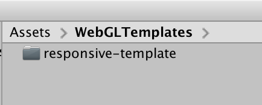
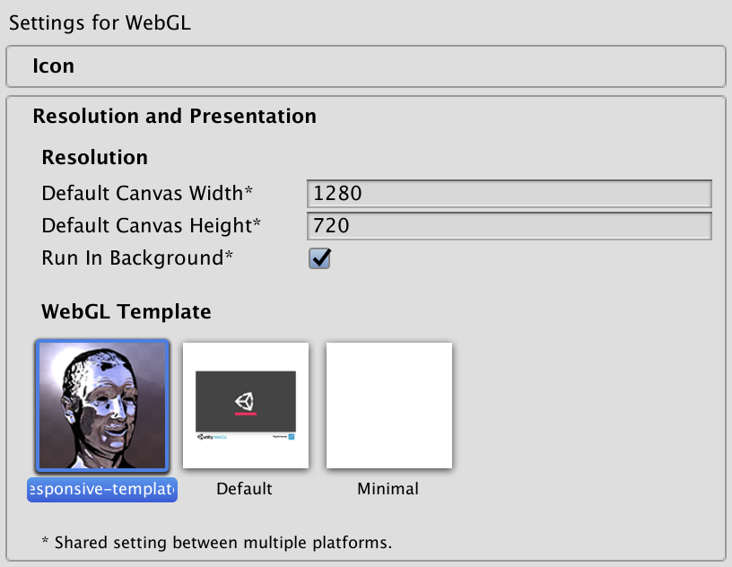

# unity-webgl-responsive

Responsive layout template for Unity WebGL applications, intended for websites that have more going on than the application itself.


[Demo](https://dom.ink/unity-webgl-responsive/)

## How to use

Create a folder called `WebGLTemplates` in the `Assets` folder of your Unity project.

For Unity 2018 and 2019, copy the `responsive-template` folder and all of its contents into `WebGLTemplates`.

For Unity 2020.1 and newer, copy the `responsive-template-2020` folder instead, as changes to the WebGL loader and templates were introduced with 2020.1.



Select the template in the Player settings (`Edit > Project Settings` then select the `Player` category) and set the default canvas resolution.



Optionally, change the max-width property of `.webgl-wrapper` in `style.css` to set the application's maximum width:

```
.webgl-wrapper {
  width: 100%;
  max-width: 1280px;
}
```

For Gzip-compressed builds (see `Publishing Settings`), you should turn on `Decompression Fallback` or configure your web server to add `Content-Encoding: gzip` response header.

## Notes

- Press F to toggle fullscreen. Customize this behavior in the script at the bottom of `index.html.`
- The application canvas preserves the aspect ratio set in the `Player` settings in `Project Settings`.

Resulting HTML includes credits and a link back to this page, which is appreciated, but feel free to remove all of that and modify the template as needed. Disney head in the example project courtesy of [David OReilly](http://www.davidoreilly.com/).
